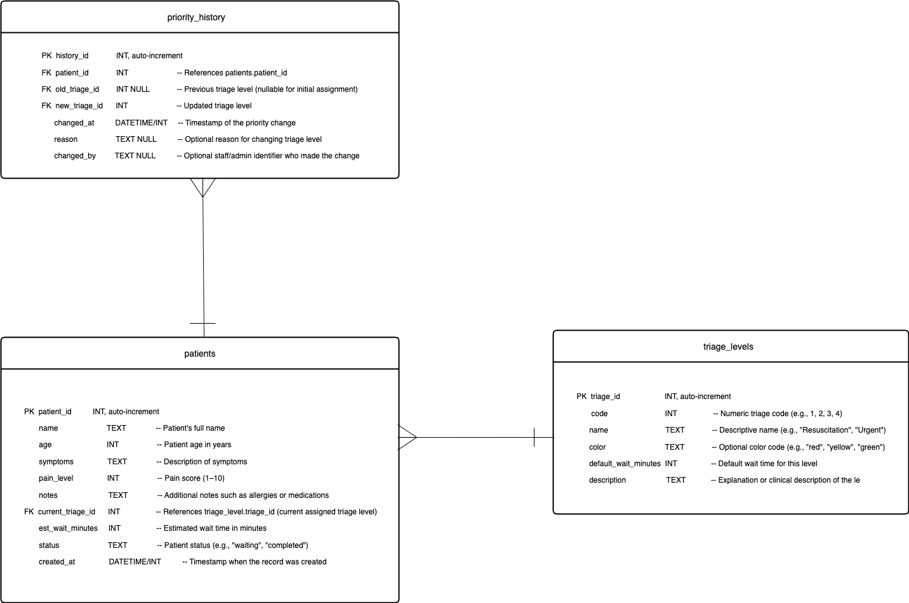

# Hospital Triage Database Design

This document describes the database schema for the **Hospital Triage Management System**.  
It includes the **entities**, their **attributes**, and the **relationships** between them.  
The goal is to support the wireframes for patient self-registration, admin triage updates, and history tracking.

---

## 1. Entities Description

### 1.1 Patients

The **patients** entity stores core patient information and their current triage status.

It contains:

- Basic demographic data (name, age)
- Clinical data (symptoms, pain level, notes)
- Operational data (current triage level, estimated wait time, status, created timestamp)

This table is the central entity used by both the patient-facing and admin-facing screens.

---

### 1.2 Triage Levels

The **triage_levels** entity represents the different urgency levels used to classify patients.

It contains:

- A numeric triage code
- A descriptive name and optional color code
- A default wait time used to estimate initial waiting times
- A description that explains the criteria for the level

This table is referenced by both **patients** and **priority_history**.

---

### 1.3 Priority History

The **priority_history** entity records every change made to a patient’s triage level.

It contains:

- A reference to the patient
- The previous and new triage levels
- The time of change
- Optional metadata such as the reason and the staff/admin who made the change

This table allows the system to reconstruct how a patient’s priority evolved over time.

---

## 2. Attributes Specification

### 2.1 Table: `patients`

| Field                | Type          | Constraints                                          | Description                                                   |
|----------------------|---------------|------------------------------------------------------|---------------------------------------------------------------|
| `patient_id`         | INT           | PRIMARY KEY, auto-increment                         | Unique identifier for each patient                            |
| `name`               | TEXT          | NOT NULL                                            | Patient full name                                             |
| `age`                | INT           | NOT NULL                                            | Patient age in years                                          |
| `symptoms`           | TEXT          | NOT NULL                                            | Description of main symptoms                                  |
| `pain_level`         | INT           | NOT NULL                                            | Pain score (1–10)                                             |
| `notes`              | TEXT          | NULL                                                | Additional notes such as allergies or medications             |
| `current_triage_id`  | INT           | FOREIGN KEY → `triage_levels.triage_id`, NOT NULL  | Currently assigned triage level                               |
| `est_wait_minutes`   | INT           | NULL                                                | Estimated wait time in minutes                                |
| `status`             | TEXT          | NULL                                                | Patient status (e.g., `"waiting"`, `"completed"`)             |
| `created_at`         | DATETIME/INT  | NOT NULL                                            | Timestamp when the patient record was created                 |

---

### 2.2 Table: `triage_levels`

| Field                  | Type          | Constraints                            | Description                                                |
|------------------------|---------------|----------------------------------------|------------------------------------------------------------|
| `triage_id`            | INT           | PRIMARY KEY, auto-increment           | Unique identifier for each triage level                    |
| `code`                 | INT           | NOT NULL                               | Numeric triage code (e.g., 1, 2, 3, 4)                     |
| `name`                 | TEXT          | NOT NULL                               | Descriptive name (e.g., `"Resuscitation"`, `"Urgent"`)     |
| `color`                | TEXT          | NULL                                   | Optional color code (e.g., `"red"`, `"yellow"`, `"green"`) |
| `default_wait_minutes` | INT           | NOT NULL                               | Default wait time in minutes                               |
| `description`          | TEXT          | NULL                                   | Explanation or clinical description of the triage level    |

---

### 2.3 Table: `priority_history`

| Field            | Type          | Constraints                                           | Description                                                    |
|------------------|---------------|-------------------------------------------------------|----------------------------------------------------------------|
| `history_id`     | INT           | PRIMARY KEY, auto-increment                          | Unique identifier for each history record                      |
| `patient_id`     | INT           | FOREIGN KEY → `patients.patient_id`, NOT NULL        | Patient whose priority was changed                             |
| `old_triage_id`  | INT           | FOREIGN KEY → `triage_levels.triage_id`, NULL        | Previous triage level (nullable for first assignment)          |
| `new_triage_id`  | INT           | FOREIGN KEY → `triage_levels.triage_id`, NOT NULL    | Updated triage level                                           |
| `changed_at`     | DATETIME/INT  | NOT NULL                                             | Timestamp when the priority change was made                    |
| `reason`         | TEXT          | NULL                                                 | Optional reason for changing triage level                      |
| `changed_by`     | TEXT          | NULL                                                 | Optional identifier for the staff/admin who made the change    |

---

## 3. Relationships

1. **`triage_levels` (1) → (M) `patients`**  
   One triage level can be assigned to many patients.

2. **`patients` (1) → (M) `priority_history`**  
   One patient can have multiple priority changes.

3. **`triage_levels` (1) → (M) `priority_history`**  
   Triage levels appear as both old/new classifications in history records.

---

## 4. ERD Diagram

The Entity-Relationship Diagram (ERD) for this database is stored in the repository as:

You can view it directly in GitHub.

---

## Authors

**Team Members:**
- **Tong Zhou**
- **Na Chi Duong**

---